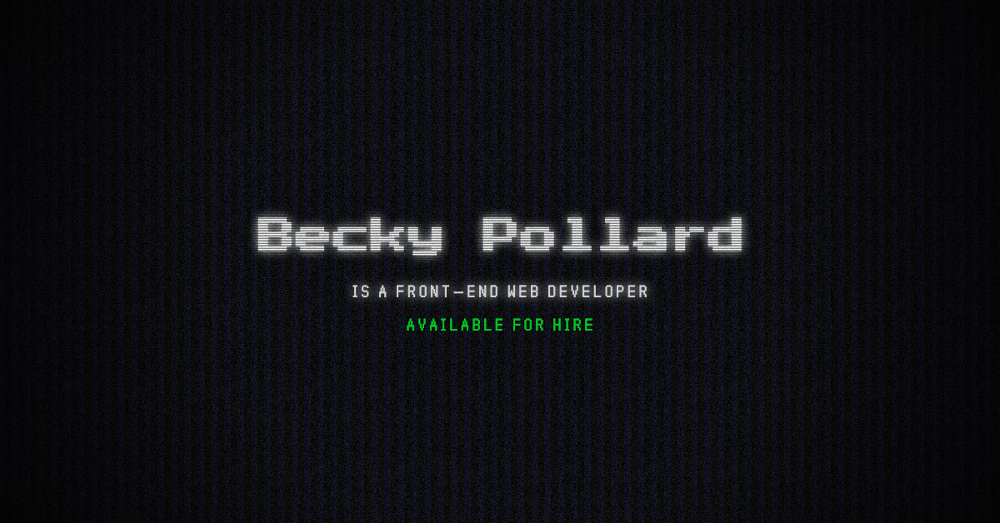

# Personal Site v3

### What's up
This is the personal webpage for Becky Pollard. Emphasis has been put on design, with the intent to recreate the aesthetics of technology and retro computing. In the past this was accomplished by using webGL to create a 3D glitch effect. In v3 I decided to focus on a CSS-only solution because the webGL usage of v2 was making the fans on my laptop go wild (probably a lot of power consumption too).

The header for the site is inspired by a computer screen, especially by the moiré effects that happen when taking a photo of many digital screens. I had originally intended to animate a moiré effect in the background of the site, but it made my eyes feel way too overwhelmed (seasick). The solution I settled on is inspired by photos of screens (the refresh rate banding), animated to give it the motion of a CRT screen's jitter, with added horizontal scan-lines to really pop the digital feeling to the piece.

### Past versions
Fun fact: this is the third version of my personal website.

- [Version 1](https://web.archive.org/web/20180118052458/http://beckypollard.com/) (2017)
- [Version 2](https://web.archive.org/web/20180805212854/http://beckypollard.com/) (2018)
- [Version 3](http://beckypollard.com) (2020)

### Netlify Deploy Status
 (becky.dev)
